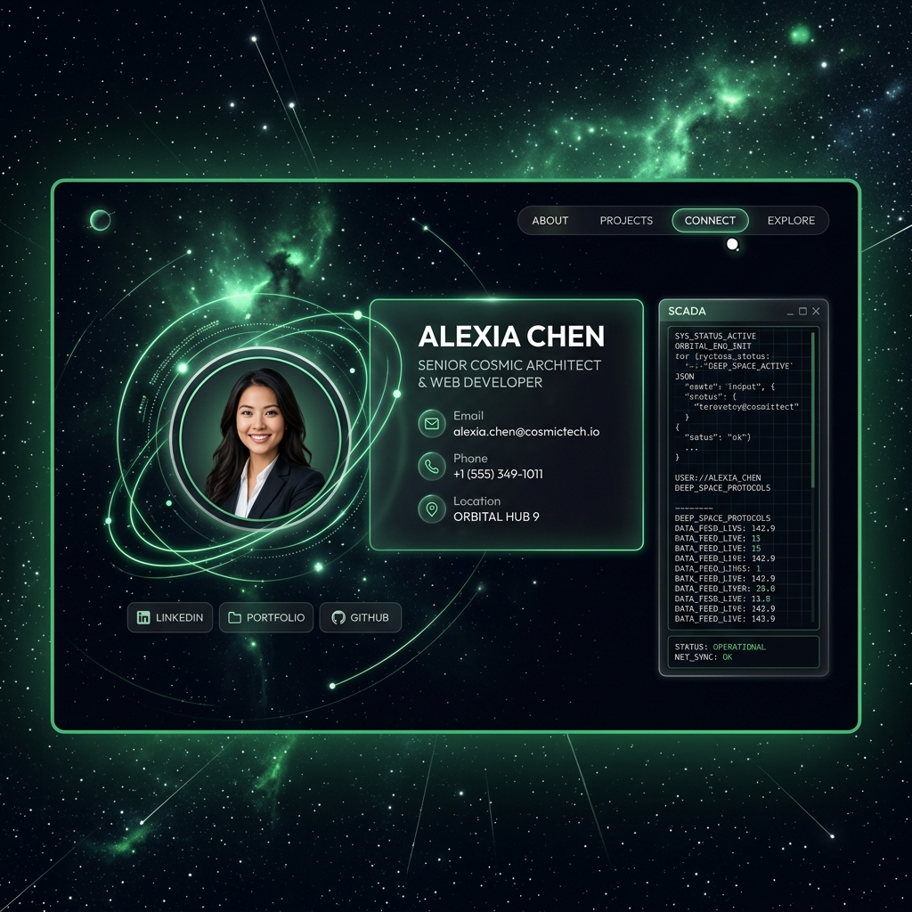

# 🪐 Tarjeta de Presentación Cósmica — Jose Luis Choquevillca

Tarjeta de presentación personal interactiva y de diseño premium con temática del espacio profundo, construida con **Astro 5 + React 18 + TailwindCSS**.



---

## 📞 Contacto Directo

| Canal | Enlace / Detalle |
|---|---|
| 📱 WhatsApp | [+591 62793829](https://wa.me/59162793829) |
| 📞 Llamar Directamente | [Llamar Ahora (tel)](tel:+59162793829) |
| 💼 LinkedIn | [jose-luis-choquevillca](https://www.linkedin.com/in/jose-luis-choquevillca/) |
| 📧 Email | [choque151.jlc@gmail.com](mailto:choque151.jlc@gmail.com) |
| 📄 Curriculum Vitae | [Solicitar CV por Correo](mailto:choque151.jlc@gmail.com?subject=Solicitud%20de%20CV) |

---

## ✨ Características y Efectos

- **Estética del Espacio Profundo:** Fondo radial galáctico animado con nebulosas pulsantes interactivas y 90 estrellas parpadeantes independientes.
- **Distribución Híbrida Inteligente:**
  * **Desktop (lg:grid):** Panel de control extendido en 3 columnas optimizado para monitores de PC.
  * **Móvil (lg:hidden):** Tarjeta física compacta interactiva en 3D que cabe al 100% de la pantalla del celular sin scroll, volteándose con un giro de 180° sobre el eje Y al tocarla.
- **Consola Industrial SCADA:** Emulador interactivo de terminal que responde a comandos operativos (`about`, `skills`, `projects`, `contact`, `constellation`, `clear`) y despliega gráficos ASCII.
- **Jerarquía Visual Elevada:** Avatar de perfil un 40% más grande con anillos orbitales metálicos pulsando a distintas velocidades de órbita.
- **Tipografía Premium:** Uso global de la tipografía **Outfit** para títulos limpios y elegantes, y **JetBrains Mono** para la terminal de control.

---

## 🛠️ Stack Tecnológico

| Capa | Tecnología |
|---|---|
| Framework | Astro v5.18 + React 18 |
| Estilos | TailwindCSS 3 |
| Iconos | Lucide React (SVG puros) |
| Tipografías | Outfit & JetBrains Mono (Google Fonts) |

---

## 🚀 Comandos de Desarrollo

Para iniciar el entorno localmente, ejecuta:

```bash
# Instalar dependencias necesarias
npm install

# Levantar el servidor de desarrollo local (Astro dev)
npm run dev      # http://localhost:4321/

# Compilar la tarjeta para distribución estática estricta
npm run build    # Archivos generados en /dist
```

---

## 📁 Estructura del Proyecto

```
src/
├── components/
│   └── App.jsx       ← Lógica de la tarjeta, consola, temas e interactividad
├── layouts/
│   └── Layout.astro  ← Cabecera HTML, SEO de la página y metadatos
├── pages/
│   └── index.astro   ← Página principal estática de Astro
└── index.css         ← Animaciones de espacio, parpadeos y glassmorphism
```
